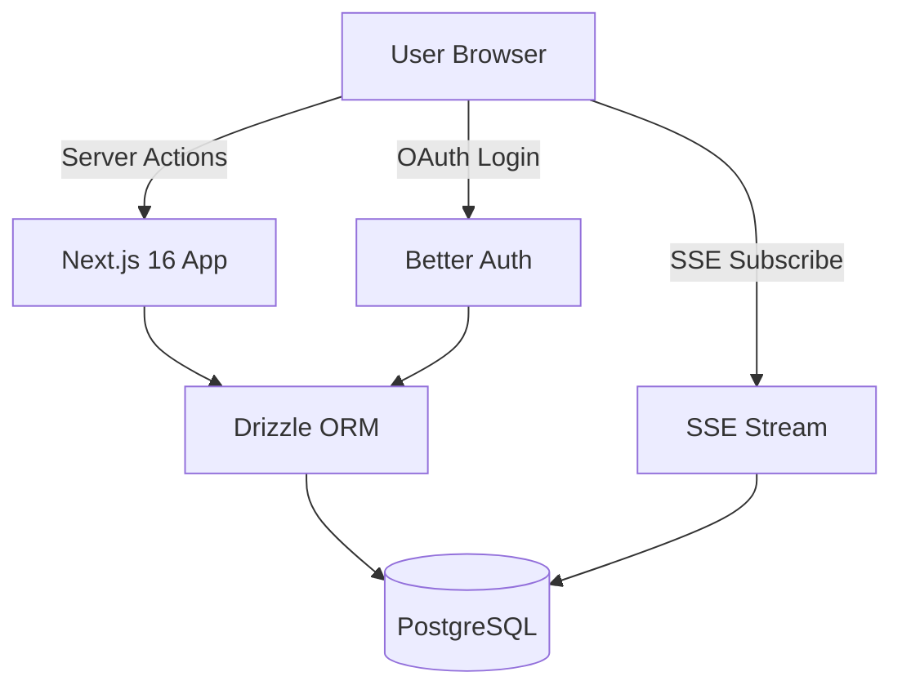

# WonderCTE: Social Cognitive Testing Platform

## Project Architecture

Modern full-stack web app optimized for social sharing, real-time competition, and beautiful UX across all devices.



## Tech Stack (2026 Cutting-Edge)

### Core Framework

- **Bun** runtime for 2x faster performance vs Node.js
- **Next.js 16** with App Router and React Server Components
- **TypeScript** strict mode throughout
- **React 19** with latest concurrent features

### Database & Backend

- **PostgreSQL** (via Neon or Vercel Postgres)
- **Drizzle ORM** for type-safe queries and migrations
- **Better Auth** for OAuth (Google/Facebook) authentication

### UI & Styling

- **Shadcn UI** components on Base UI primitives
- **Tailwind CSS** for responsive design
- **Framer Motion** for smooth animations
- **Lucide Icons** for modern iconography

### Real-time Features

- **Server-Sent Events (SSE)** for unidirectional server→client streaming
- **Next.js Server Actions** for client→server mutations
- Native HTTP-based streaming (no external WebSocket service needed)

### Developer Experience

- **Drizzle Kit** for database migrations
- **Zod** for runtime validation
- **ESLint** + **Prettier** for code quality
- **Husky** for pre-commit hooks

### Deployment

- **Vercel** for hosting and edge functions
- **Sentry** for error monitoring
- **Vercel Analytics** for performance tracking

## Database Schema

```typescript
// Core tables with Drizzle schema
users:
  - id (uuid, pk)
  - email (unique)
  - name
  - avatar_url
  - google_id (nullable)
  - facebook_id (nullable)
  - created_at

test_attempts:
  - id (uuid, pk)
  - user_id (fk to users)
  - score (integer 0-100)
  - time_taken_seconds
  - completed_at
  - questions_answered (jsonb)

groups:
  - id (uuid, pk)
  - name
  - invite_code (unique, 8 chars)
  - creator_id (fk to users)
  - is_public (boolean)
  - created_at

group_members:
  - id (uuid, pk)
  - group_id (fk to groups)
  - user_id (fk to users)
  - joined_at
  - UNIQUE(group_id, user_id)

test_questions:
  - id (uuid, pk)
  - question_text
  - question_type (enum: math, verbal, logic, spatial)
  - difficulty (1-5)
  - correct_answer
  - options (jsonb)
```

## Key Features Implementation

### 1. Authentication Flow

- OAuth integration with Better Auth
- Google and Facebook provider setup
- Session management with secure httpOnly cookies
- User profile creation on first login

### 2. Test System

- Dynamic question generation from database
- Configurable test duration and question count
- Client-side timer with server validation
- Progress tracking and state persistence
- Anti-cheat measures (tab switching detection, time validation)

### 3. Leaderboard System

- **Global Leaderboard**: All users ranked by best score
- **Group Leaderboards**: Private rankings within friend groups
- Real-time updates via SSE streams (simpler than WebSockets)
- Server Actions for score submissions and revalidation
- Optimized queries with database indexes
- React Suspense boundaries for streaming UI

### 4. Social Features

- **Share Links**: Generate unique group invite codes
- **Friend Invites**: Send direct invitations via email/SMS
- **Group Management**: Create, join, leave groups
- **Activity Feed**: See when friends complete tests
- **Notifications**: Real-time alerts for friend activity
- **Challenge Mode**: Direct friend-to-friend challenges

### 5. Responsive Design

- Mobile-first approach with Tailwind breakpoints
- Touch-optimized test interface for tablets/phones
- Progressive Web App (PWA) capabilities
- Optimistic UI updates for instant feedback
- Skeleton loaders and streaming UI

## Project Structure

```
wondercte/
├── src/
│   ├── app/                    # Next.js 16 App Router
│   │   ├── (auth)/
│   │   │   ├── login/
│   │   │   └── signup/
│   │   ├── (test)/
│   │   │   ├── test/
│   │   │   └── results/
│   │   ├── (dashboard)/
│   │   │   ├── dashboard/
│   │   │   ├── leaderboard/
│   │   │   └── groups/
│   │   ├── api/               # API routes
│   │   │   ├── auth/
│   │   │   ├── test/
│   │   │   └── sse/          # SSE endpoints
│   │   └── layout.tsx
│   ├── components/
│   │   ├── ui/               # Shadcn components
│   │   ├── test/
│   │   ├── leaderboard/
│   │   └── groups/
│   ├── lib/
│   │   ├── db/               # Drizzle schema & client
│   │   ├── auth/             # Better Auth config
│   │   ├── sse/              # SSE utilities
│   │   ├── actions/          # Server Actions
│   │   └── utils/
│   └── types/
├── drizzle/                   # Migrations
├── public/
├── package.json
├── bun.lockb
├── tailwind.config.ts
├── drizzle.config.ts
└── next.config.js
```

## Implementation Phases

### Phase 1: Foundation Setup

- Initialize Bun + Next.js 16 project
- Configure TypeScript, ESLint, Prettier
- Setup Drizzle ORM with PostgreSQL
- Configure Better Auth with Google/Facebook
- Setup Shadcn UI and Tailwind
- Create basic layout and navigation

### Phase 2: Authentication & User Management

- Implement OAuth login flows
- Create user profile pages
- Setup session management
- Build user onboarding flow

### Phase 3: Test System

- Design question database schema
- Create test question bank
- Build test interface with timer
- Implement answer validation
- Create results page with score breakdown
- Add test history tracking

### Phase 4: Leaderboard System

- Build global leaderboard with pagination
- Implement efficient ranking queries
- Add filtering and sorting options
- Create leaderboard UI components
- Setup caching strategy

### Phase 5: Group Features

- Create group management pages
- Implement invite code system
- Build group leaderboards
- Add group discovery features
- Create group activity feeds

### Phase 6: Real-time Features (SSE + Server Actions)

- Create SSE endpoint for leaderboard updates (`/api/sse/leaderboard`)
- Implement EventSource client-side subscription
- Build Server Actions for score submission and revalidation
- Add optimistic UI updates with Server Actions
- Create activity feed with SSE streaming
- Add auto-reconnection logic for dropped connections

### Phase 7: Social Sharing

- Generate shareable test links
- Add social media share buttons
- Create embeddable score cards
- Implement referral tracking
- Add viral loop mechanics

### Phase 8: Polish & Optimization

- Mobile responsive testing
- Performance optimization
- Add animations and transitions
- Implement PWA features
- Setup error monitoring
- Load testing and optimization
- SEO optimization

### Phase 9: Testing & Deployment

- Unit tests for critical paths
- Integration tests for API routes
- E2E tests with Playwright
- Setup CI/CD pipeline
- Deploy to Vercel
- Configure domain and SSL

## Performance Targets

- **First Contentful Paint**: < 1.2s
- **Time to Interactive**: < 2.5s
- **Lighthouse Score**: > 95
- **Bundle Size**: < 150KB initial JS
- **API Response Time**: < 200ms p95
- **SSE Update Latency**: < 500ms

## Security Considerations

- OAuth token secure storage
- CSRF protection on API routes
- Rate limiting on test submissions
- Input validation with Zod
- SQL injection prevention (Drizzle parameterized queries)
- SSE stream authentication via session tokens
- Environment variable management
- Server Action CSRF protection (built-in Next.js)

## Future Enhancements

- AI-generated personalized questions
- Detailed performance analytics
- Practice mode with explanations
- Different test types (memory, speed, logic)
- Team competitions
- Premium features (Stripe integration)
- Mobile native apps (React Native)
- Internationalization

## Why This Stack Wins

1. **Performance**: Bun provides 40ms startup vs 150ms Node.js, 30% lower memory
2. **Type Safety**: Full-stack TypeScript with Drizzle ORM eliminates runtime errors
3. **Modern UX**: React 19 Server Components reduce bundle size 40%
4. **Simple Real-time**: SSE + Server Actions (no external WebSocket service, lower complexity)
5. **Social-First**: Better Auth multi-tenancy perfect for group management
6. **Developer Experience**: Drizzle migrations, Shadcn components, TypeScript
7. **Scalability**: Edge functions, database connection pooling, efficient queries
8. **Cost-Effective**: Vercel free tier, Neon free tier, no WebSocket service costs

This architecture positions WonderCTE as a fast, modern, viral social testing platform ready for rapid user growth.